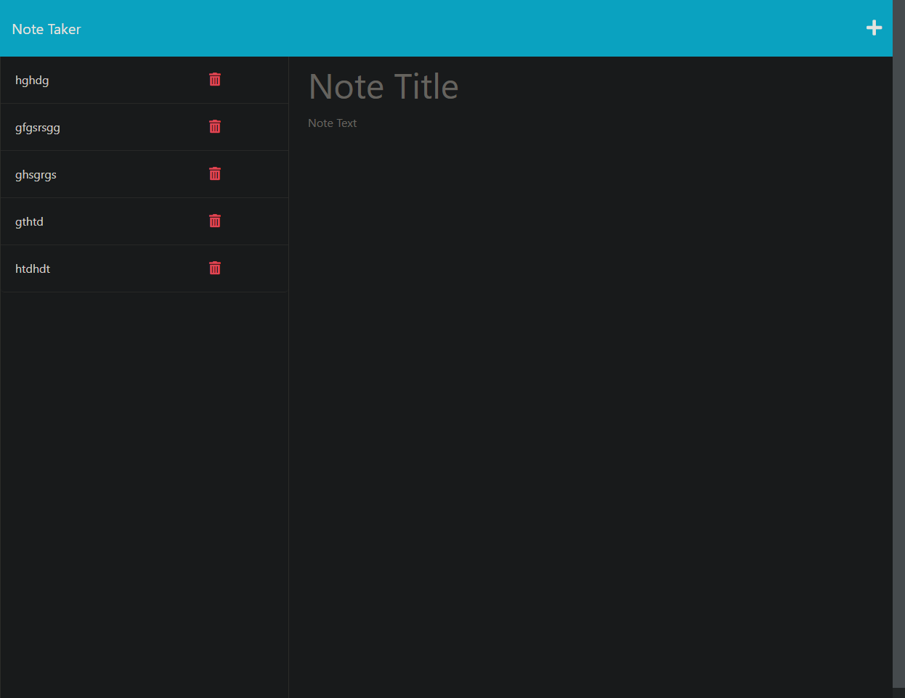

# Express-Notes

## Description
This repository allows users to create notes with titles and text.  Users notes are saved to the server and allow the user to go back and edit previous notes.

To view the Webpage click [here] (https://deploying-express-notes-b95817719010.herokuapp.com).

## Usage
Users will click the add note button on the homepage.

The user will then be directed to the notes page, and be allowed to enter a note title/text.

Once the user inputs the title/text they will be able to hit the save button icon at the top and save their note.

The user will be able to click previous notes to edit and save them.